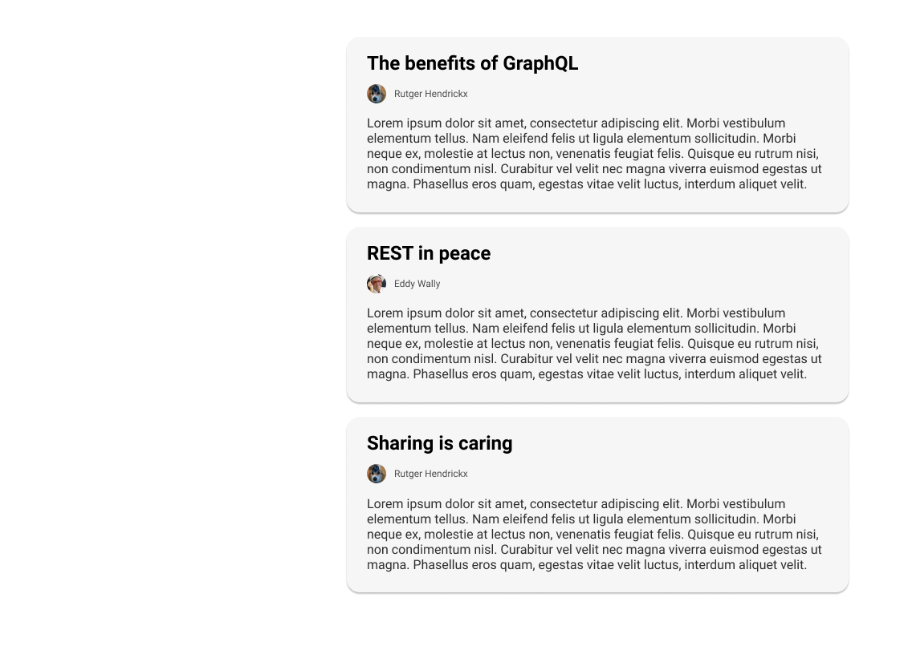
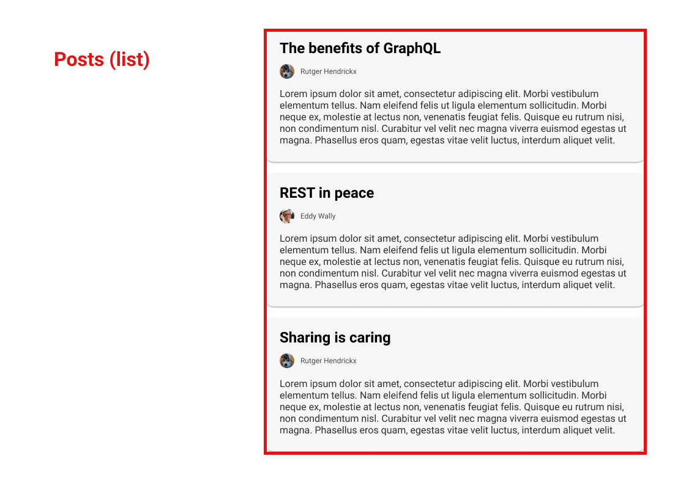
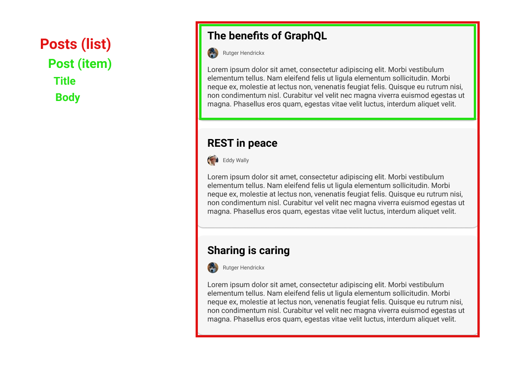
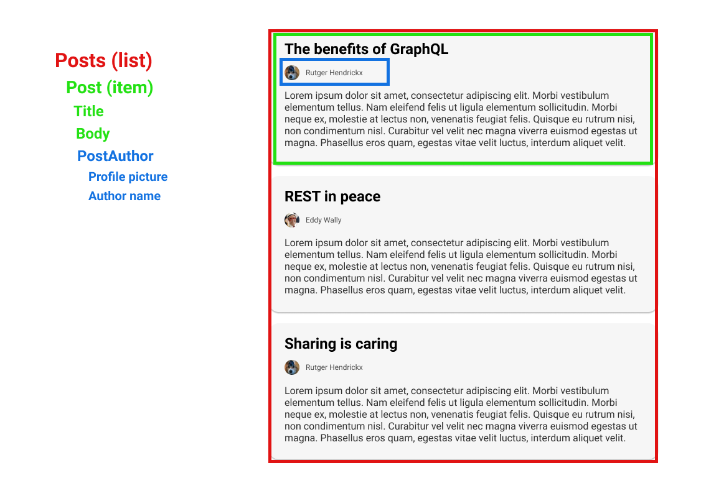

import { default as light } from "mdx-deck/themes";
import { Appear } from "mdx-deck";
import { CodeSurfer } from "mdx-deck-code-surfer";
export { components } from "mdx-deck-code-surfer";
import nightOwl from "prism-react-renderer/themes/nightOwl";
import { GraphQLSvgLogo } from "./components/GraphQLSvgLogo";
import { Bold } from "./components/Bold";
import { Quote } from "./components/Quote";
import { BulletList, BulletPoint } from "./components/Bullets";
import { Strikethrough } from "./components/Strikethrough";
import { Highlight } from "./components/Highlight";
import { Link } from "./components/Link";

export const theme = {
  ...light,
};

# GraphQL

<GraphQLSvgLogo />

#### What's the hype?

---

# The "official" definition

<Quote
  quote="GraphQL is a query language for your API, and a server-side runtime for executing queries by using a type system you define for your data. GraphQL isn't tied to any specific database or storage engine and is instead backed by your existing code and data."
  source="https://graphql.org"
/>

---

# Let's set the scene

---



---



---



---



```notes
How do we fetch data for this component from a REST backend?
```

---

## #1: We fetch all posts

`/api/posts/`

---

<CodeSurfer
  title="/api/posts"
  lang="json"
  showNumbers={false}
  code={require("!raw-loader!./snippets/api_posts_all.json.txt")}
  steps={[{}, { lines: [11, 22] }]}
/>

```notes
Explain how this is too much data in one way and too little in another (author).
```

---

## #2: We fetch the author for each post...

`/api/user/{id}`

---

<CodeSurfer
  title="for the first post..."
  lang="json"
  showNumbers={false}
  code={require("!raw-loader!./snippets/api_user_1.json.txt")}
/>

---

<CodeSurfer
  title="for the second post..."
  lang="json"
  showNumbers={false}
  code={require("!raw-loader!./snippets/api_user_2.json.txt")}
/>

---

<CodeSurfer
  title="for the third post..."
  lang="json"
  showNumbers={false}
  code={require("!raw-loader!./snippets/api_user_1.json.txt")}
/>

---

`/api/posts`

`/api/author/1`

`/api/author/2`

`/api/author/1`

```notes
This can be solved, but it's up to the CLIENT.
```

---

## Problems?

<BulletList>
  <BulletPoint>
    We asked for the same author <Bold>twice</Bold>.
  </BulletPoint>
  <BulletPoint>
      The first request resulted in <Bold>under-fetching</Bold> (missing author)
  </BulletPoint>
  <BulletPoint>
      All requests combined resulted in <Bold>over-fetching</Bold> (too many fields)
  </BulletPoint>
</BulletList>

---

## More to think about...

<BulletList>
  <BulletPoint>Which endpoints can we use?</BulletPoint>
  <BulletPoint>
    What do these endpoints return?
  </BulletPoint>
  <BulletPoint>
    What fields are required and which ones are optional?
  </BulletPoint>
  <BulletPoint>
    What input parameters are available?
  </BulletPoint>
  <BulletPoint>
    How do we know what fields the Apps are actively using?
  </BulletPoint>
</BulletList>

---

## Let's call the BFF!

### (Backend For Frontend)

```notes
A lot of organizations recognized these problems, and started building Backends fro Frontends.

This means they would build an specific endpoint implementation for each page/view in their App/Site.
```

---

<CodeSurfer
  title="/api/presentation/posts-list"
  lang="json"
  showNumbers={false}
  code={require("!raw-loader!./snippets/api_presentation_posts_list.json.txt")}
  steps={[{}, { range: [7, 11] }]}
/>

---

## Did we solve anything?

<BulletList>
  <BulletPoint>
    <Strikethrough>
      We asked for the same author <Bold>twice</Bold>.
    </Strikethrough>
  </BulletPoint>
  <BulletPoint>
    <Strikethrough>
      <Bold>under-fetching</Bold>
    </Strikethrough>
  </BulletPoint>
  <BulletPoint>
    <Strikethrough>
      <Bold>over-fetching</Bold>
    </Strikethrough>
  </BulletPoint>
  <BulletPoint>Which endpoints can we use?</BulletPoint>
  <BulletPoint>
    What do these endpoints return?
  </BulletPoint>
  <BulletPoint>
    What fields are required and which ones are optional?
  </BulletPoint>
  <BulletPoint>
    What input parameters are available?
  </BulletPoint>
  <BulletPoint>
    How do we know what fields the Apps are actively using?
  </BulletPoint>
</BulletList>

```notes
Mention what happens when we add a new field to an entity.
```

---

## What's the root of the problem with these approaches?

<BulletList>
  <BulletPoint>
    The <Bold>server</Bold> is in charge of dicating the response of the
    payloads, not the client.
  </BulletPoint>
  <BulletPoint>
    Resources (/posts, /authors) are organized in terms of <Bold>endpoints</Bold>
  </BulletPoint>
  <BulletPoint>
    The endpoints are returning <Bold>fixed</Bold> responses.
  </BulletPoint>
  <BulletPoint>
    Documentation is <Bold>not</Bold> a first-class citizen.
  </BulletPoint>
</BulletList>

---

## and specifically for REST...

REST became only a convention, this led to:

<BulletList>
  <BulletPoint>
    Meaningless discussions about which status codes to return
  </BulletPoint>
  <BulletPoint>
    Meaningless discussion about wether to return an ID, a nested object or a
    Hyperlink URL for a relation
  </BulletPoint>
  <BulletPoint>Documentation was an afterthought</BulletPoint>
  <BulletPoint>Focussed more on the backend than the frontend</BulletPoint>
</BulletList>

```notes
REST is not a formal specification, it's just a convention and leaves implementation open for developers on both ends of the stack (back and front). This in turns leds to:
```

---

# Okay, so then what?

---

<CodeSurfer
  title="Let's take our BFF response"
  lang="json"
  showNumbers={false}
  code={require("!raw-loader!./snippets/api_presentation_posts_list.json.txt")}
/>

---

<CodeSurfer
  title="GraphQL"
  lang="graphql"
  showNumbers={false}
  code={require("!raw-loader!./snippets/graphql_posts_query.graphql")}
  steps={[{}, { range: [3, 10] }]}
/>

---

<CodeSurfer
  title="and the server responds"
  lang="graphql"
  showNumbers={false}
  code={require("!raw-loader!./snippets/graphql_posts_query_response.json.txt")}
  steps={[{}, { range: [4, 11] }]}
/>

---

# That's GraphQL!

(kk, thx, bye!)

---

<h2>
  GraphQL is a <Highlight>query language</Highlight> for APIs which exposes
  itself over a <Highlight>single endpoint</Highlight>.
</h2>

---

<h2>
  The endpoint provides a <Highlight>typed schema</Highlight> which represents a
  data graph that includes all the entities that are available within the
  system.
</h2>

---

<h2>
  The GraphQL schema is defined by a{" "}
  <Highlight>Schema Definition Language (SDL)</Highlight> which consists of the
  following major building blocks:
</h2>
<BulletList>
  <BulletPoint>Types (and fields)</BulletPoint>
  <BulletPoint>Scalars (Int, Bool, String, ID)</BulletPoint>
  <BulletPoint>Enumerations</BulletPoint>
  <BulletPoint>Input Types</BulletPoint>
  <BulletPoint>Interfaces</BulletPoint>
</BulletList>

---

<CodeSurfer
  title="A simple Schema for our posts"
  lang="json"
  showNumbers={false}
  code={require("!raw-loader!./snippets/graphql_schema_simple.graphql")}
  steps={[
    {},
    { lines: [1], notes: "We start with a type for User" },
    { lines: [2], notes: "A user has a unique ID, this field is required." },
    { lines: [3], notes: "A user has a fullName, this is a required String" },
    {
      lines: [4],
      notes: "A user has a profilePicture, this is an optional String",
    },
    { range: [7, 12], notes: "Next we define a type for Post" },
    {
      lines: [11],
      notes: "We define a relation between Post and our User type",
    },
    { lines: [14], notes: "We define a RootQuery type" },
    { lines: [15], notes: "And expose a way to query for all posts" },
  ]}
/>

---

<h2>
  Whenever we send our query to this GraphQL endpoint. The query will be{" "}
  <Highlight>validated</Highlight> against the schema to ensure we're asking for
  fields and types that exist.
</h2>

---

<h2>
  When the query is valid it will be <Highlight>executed</Highlight>.
</h2>

---

<h2>
  The query is executed by <Highlight>async</Highlight> functions that know how
  to <Highlight>resolve</Highlight> each type and field. These functions are
  called <Highlight>resolvers</Highlight>.
</h2>

```notes
To be demo'd
```

---

## What about creating or modifying data?

---

<h2>
  In order to <Highlight>mutate</Highlight> data GraphQL allows for the ability
  to expose a set of <Highlight>Mutations</Highlight>.
</h2>

---

<CodeSurfer
  title="Create post mutation"
  lang="json"
  showNumbers={false}
  code={require("!raw-loader!./snippets/graphql_schema_mutation.graphql")}
  steps={[
    {},
    { lines: [1], notes: "We define a Mutation type" },
    { lines: [2], notes: "It has a field with an input to create a new post" },
    {
      lines: [5],
      notes: "We define an Input type for the postCreate mutation",
    },
    {
      lines: [6],
      notes: "It requires a title",
    },
    {
      lines: [7],
      notes: "and a body",
    },
    {},
  ]}
/>

---

## So, what makes GraphQL different?

<BulletList>
  <BulletPoint>
    Formal <Bold>specification</Bold>
  </BulletPoint>
  <BulletPoint>
    <Bold>Client driven</Bold>, the client describes <Bold>exactly</Bold> what
    it needs.
  </BulletPoint>
  <BulletPoint>
    It exposes a <Bold>strongly typed</Bold> schema
  </BulletPoint>
  <BulletPoint>
    Documentation is <Bold>part of the schema</Bold>
  </BulletPoint>
  <BulletPoint>
    Data is exposed in terms of a Graph, with <Bold>first-class</Bold> support
    for relations
  </BulletPoint>
  <BulletPoint>
    The schema allows for <Bold>introspection</Bold>, which enables advanced
    tooling
  </BulletPoint>
</BulletList>

---

# Demo Time!

---

# Questions?

---

# Resources

<Link href="https://graphql.org/">https://graphql.org/</Link>
<br />
<Link href="https://www.apollographql.com/docs/apollo-server/">https://www.apollographql.com/docs/apollo-server/</Link>
<br />
<Link href="https://www.apollographql.com/docs/react/">https://www.apollographql.com/docs/react/</Link>
<br />
<Link href="https://graphql-code-generator.com/">https://graphql-code-generator.com/</Link>
<br />
<Link href="https://github.com/Nayni/graphql-introduction">https://github.com/Nayni/graphql-introduction</Link>
---

<h1>
  <span style={{ color: "red" }}>♥️</span> Thank <Highlight>you!</Highlight> <span style={{ color: "red" }}>♥️</span>
</h1>
